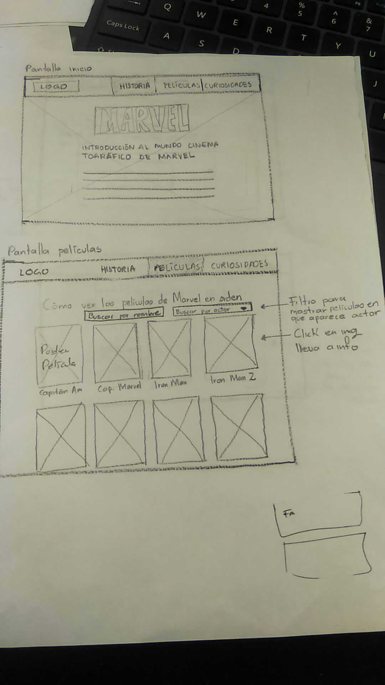

## "Hackathon" de final de Common Core, películas.

# MarvelPEDIA

En 2008 la productora Marvel Studios realizó Iron Man, primera película del universo Marvel y desde entonces no ha parado de estrenar películas. 
Todas estas películas tienen continuidad entre ellas, están enlazadas, y los sucesos que ocurren en ellas tienen repercusión en las siguientes, todo esto ha causado una gran popularidad entre fans y no fans de los cómics en los que se basan las historias, aunque por otra parte, existen también las personas que debido a la popularidad reconocen el Universo Cinematográfico de Marvel (MCU por sus siglas en inglés), pero no tienen la motivación o medios para adentrarse en este mundo. Es entonces que surge "MarveLPEDIA" como un medio para adentrar a los usuarios interesados al MCU de una manera sencilla e intuitiva.

## Usuario principal
MarvelPEDIA se dirige a hombres y mujeres de entre 15 y 40 años que hablan inglés, tienen gusto por el uso de la tecnología, que gustan de las películas de acción, superhéroes o ciencia ficción, que no conocen del MCU y que están interesados en adentrarse en este mundo cinematográfico.

## El objetivo y descripción del sitio MarvelPEDIA
El objetivo de MArvelPEDIA es apoyar a los usuarios para adentrarse al universo cinematrografico de Marvel, esto a través de presentarle el ordenado cronológico en que transcurren las historias de las películas y mostrarle otras opciones para interactuar; una de ellas es el filtrado por actor en donde el usuario podrá visualizar las películas en donde aparece su actor preferido, otra opción que el usuario encontrará es que: al hacer click sobre la película deseada se mostrará información básica, tales como: el trailer, el ranking, comentarios de personas que han visto las películas y sugerencias de plataformas para poder ver la película que desea.

También se integra una sección en el sitio en donde se mostrará en una pantalla la linea del tiempo con la información general del cómo surge Marvel para contextualizar al usuario sobre la historia del MCU. Y por otra parte para atraer aún más al usuario se presenta una sección en donde se presentan curiosidades sobre los personajes, específicamente la evolución de los trajes de los superhéroes a través de los años y las diferentes películas.

---
## Prototipo de baja fidelidad
Para la realización del sitio web se generaron prototipos de baja fidelidad para ser testeados por algunos usuarios.

- Para desktop

- Para celular

---
## Prototipo de alta fidelidad
Luego de test con usuarios se realizaron prototipos en alta fidelidad que contienen los cambios y observaciones arrojadas por ellos.

- [Para desktop](https://www.figma.com/file/Lgq0bPe2k9Sf3fNqz2JAVMrO/MarvelPEDIA-desktop)

- [Para celular](https://www.figma.com/file/SjLjy69Qh62TuJAvXTe7VTMl/MarvelPEDIA-responsive-mobile)
---
## El Trabajo en equipo
El trabajo en equipo fue organizado mayormente en tareas cuya responsabilidad fue asignada de acuerdo a gustos y habilidades de las integrantes del equipo, quedando la organización de la manera siguiente:

### *Iris y Lucero:
- Entrevistas para el estudio de mercado a diferentes usuarios.
- Planeación del proyecto e historias de usuario.
- Prototipo de baja fidelidad (Sketch). 
- Prototipo de alta fidelidad en figma.
- Desarrollo de pantallas (Home, movies, super suit, story) en html, css y js.

### *Mel e Itzel:
- Entrevistas para el estudio de mercado a diferentes usuarios.
- Planeación del proyecto e historias de usuario.
- Prototipo de baja fidelidad (Sketch). 
- Prototipo de alta fidelidad en figma.
- Desarrollo de funcionalidad en js de orden de las peliculas y filtro por actor.
- Desarrollo funcional del modal para mostrar pantalla con información básica de la película, trailer, ranking y comentarios.

--- 